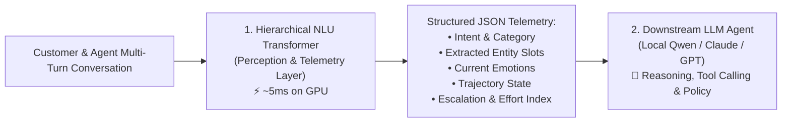

# 🚀 Multi-Task & Hierarchical Customer Support NLU

An enterprise-grade, dual-level Conversational NLU Perception Engine built with PyTorch and Transformers (DistilBERT + Hierarchical Turn-Transformer) for real-time customer support routing, emotion telemetry, and escalation tracking.

---

## 📌 Architecture Overview



---

## 📁 Repository Contents

| File / Artifact | Description |
| :--- | :--- |
| **`test.ipynb`** | Single-turn & multi-task NLU notebook (Intent, Category, 14 Emotion Flags, NER Slots, Escalation Regressors). |
| **`multi_turn_nlu.ipynb`** | Hierarchical Turn-Transformer (HAT) with Speaker Embeddings & Trajectory Summarizer. |
| **`best_multitask_nlu.pt`** | Trained PyTorch weights for Single-Turn Multi-Task NLU (`val_loss = 0.1056`, 99.75% Intent Accuracy). |
| **`best_hierarchical_nlu.pt`** | Trained PyTorch weights for Multi-Turn Hierarchical Dialogue Transformer. |
| **`twitter_sample_threads.json`** | Extracted multi-turn dialogue threads from Twitter Customer Support dataset (`twcs.csv`). |
| **`Bitext_Sample_Customer_Support_Training_Dataset_27K_responses-v11.csv`** | Clean Bitext dataset with 27 intents, 11 categories, and 14 linguistic flags. |

---

## ⚡ Quick Start

### 1. Environment Setup
```bash
conda create -n genai python=3.10
conda activate genai
pip install torch transformers pandas numpy scikit-learn tqdm
```

### 2. Run Notebooks
- Open `test.ipynb` for single-turn intent, emotion, and slot extraction.
- Open `multi_turn_nlu.ipynb` for multi-turn conversational trajectory and escalation tracking.

---

## 📊 Sample Output Payload (Sent to Downstream LLM Agent)

```json
{
  "intent": "cancel_order",
  "category": "ORDER",
  "entities": {
    "Order_Number": "ORD-88192"
  },
  "trajectory_state": "CRITICAL_CHURN_RISK",
  "dynamic_escalation": 0.867,
  "customer_effort_score": 0.821,
  "current_emotion_profile": {
    "Anger": "100.0%",
    "Frustration": "63.7%",
    "Distress": "61.1%",
    "Politeness": "0.0%"
  }
}
```
